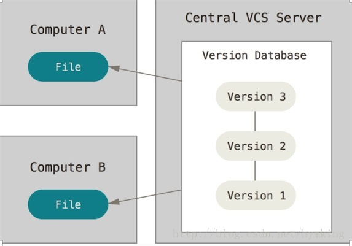
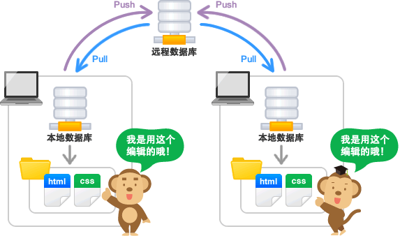

## Git 教程

		Git是一个开源的分布式版本控制系统，可以有效、高速的处理从很小到非常大的项目版本管理。起初Git 是 Linus Torvalds 为了帮助管理 Linux 内核开发而开发的一个开放源码的版本控制软件。

## 1. 集中式VS分布式

###### 集中式
    1. SVN只能有一个指定中央版本库。当这个中央版本库有问题时，所有工作成员都一起瘫痪直到版本库维修完毕或者新的版本库设立完成

###### 分布式
		Git可以有无限个版本库，每一个Git都是一个版本库，区别是它们是否拥有活跃目录（Git Working Tree）。如果主要版本库（例如：GitHub的版本库）出现故障，工作成员仍然可以在自己的本地版本库（local repository）提交，等待主要版本库恢复即可。工作成员也可以提交到其他的版本库。并且即使在没有网络的情况下，Git仍然可以查看版本历史记录，日志，及版本记录等。

## 2. 安装

[msysgit](https://gitforwindows.org/)
[TortoiseGit](https://tortoisegit.org/)

## 3. Git Bash命令使用

	# 在当前目录新建一个Git代码库
	$ git init

	# 新建一个目录，将其初始化为Git代码库
	$ git init [project-name]

	# 下载一个项目和它的整个代码历史
    $ git clone [url]
###### Git的设置文件为.gitconfig，它可以在用户主目录下（全局配置），也可以在项目目录下（项目配置）
	# 显示当前的Git配置
	$ git config --list

	# 编辑Git配置文件
	$ git config -e [--global]

	# 设置提交代码时的用户信息
	$ git config [--global] user.name "[name]"
	$ git config [--global] user.email "[email address]"

###### 添加/删除命令
	# 添加指定文件到暂存区
	$ git add [file1] [file2] ...

	# 添加指定目录到暂存区，包括子目录
	$ git add [dir]

	# 添加当前目录的所有文件到暂存区
	$ git add .

	# 添加每个变化前，都会要求确认
	# 对于同一个文件的多处变化，可以实现分次提交
	$ git add -p

	# 删除工作区文件，并且将这次删除放入暂存区
	$ git rm [file1] [file2] ...

	# 停止追踪指定文件，但该文件会保留在工作区
	$ git rm --cached [file]

	# 改名文件，并且将这个改名放入暂存区
	$ git mv [file-original] [file-renamed]

###### 代码提交
	# 提交暂存区到仓库区
	$ git commit -m [message]

	# 提交暂存区的指定文件到仓库区
	$ git commit [file1] [file2] ... -m [message]

    # 提交时显示所有diff信息
	$ git commit -v

###### 分支

	# 列出所有本地分支
	$ git branch

	# 列出所有远程分支
	$ git branch -r

	# 列出所有本地分支和远程分支
	$ git branch -a

	# 新建一个分支，但依然停留在当前分支
	$ git branch [branch-name]

	# 新建一个分支，并切换到该分支
	$ git checkout -b [branch]

	# 新建一个分支，指向指定commit
	$ git branch [branch] [commit]

	# 新建一个分支，与指定的远程分支建立追踪关系
	$ git branch --track [branch] [remote-branch]

	# 切换到指定分支，并更新工作区
	$ git checkout [branch-name]

	# 切换到上一个分支
	$ git checkout -

	# 建立追踪关系，在现有分支与指定的远程分支之间
	$ git branch --set-upstream [branch] [remote-branch]

	# 合并指定分支到当前分支
	$ git merge [branch]

	# 选择一个commit，合并进当前分支
	$ git cherry-pick [commit]

	# 删除分支
    $ git branch -d [branch-name]

	# 删除远程分支
	$ git push origin --delete [branch-name]
	$ git branch -dr [remote/branch]

###### 标签
	# 列出所有tag
	$ git tag

	# 新建一个tag在当前commit
	$ git tag [tag]

	# 新建一个tag在指定commit
	$ git tag [tag] [commit]

	# 删除本地tag
	$ git tag -d [tag]

	# 删除远程tag
	$ git push origin :refs/tags/[tagName]

	# 查看tag信息
	$ git show [tag]

	# 提交指定tag
	$ git push [remote] [tag]

	# 提交所有tag
	$ git push [remote] --tags

	# 新建一个分支，指向某个tag
	$ git checkout -b [branch] [tag]

###### 其他命令
	# 显示有变更的文件
	$ git status

	# 显示当前分支的版本历史
	$ git log

	# 显示commit历史，以及每次commit发生变更的文件
	$ git log --stat

	# 搜索提交历史，根据关键词
	$ git log -S [keyword]

	# 显示某个commit之后的所有变动，每个commit占据一行
	$ git log [tag] HEAD --pretty=format:%s

	# 显示某个commit之后的所有变动，其"提交说明"必须符合搜索条件
	$ git log [tag] HEAD --grep feature

	# 显示某个文件的版本历史，包括文件改名
	$ git log --follow [file]
	$ git whatchanged [file]

	# 显示指定文件相关的每一次diff
	$ git log -p [file]

	# 显示过去5次提交
	$ git log -5 --pretty --oneline

	# 显示所有提交过的用户，按提交次数排序
	$ git shortlog -sn

	# 显示指定文件是什么人在什么时间修改过
	$ git blame [file]

	# 显示暂存区和工作区的代码差异
	$ git diff

	# 显示暂存区和上一个commit的差异
	$ git diff --cached [file]

	# 显示工作区与当前分支最新commit之间的差异
	$ git diff HEAD

	# 显示两次提交之间的差异
	$ git diff [first-branch]...[second-branch]

	# 显示今天你写了多少行代码
	$ git diff --shortstat "@{0 day ago}"

	# 显示某次提交的元数据和内容变化
	$ git show [commit]

	# 显示某次提交发生变化的文件
	$ git show --name-only [commit]

	# 显示某次提交时，某个文件的内容
	$ git show [commit]:[filename]

	# 显示当前分支的最近几次提交
	$ git reflog

	# 从本地master拉取代码更新当前分支：branch 一般为master
	$ git rebase [branch]

## 4. 分支
*git 和 svn 的一个显著区别就是提供更丰富的分支特性*

- master 分支 *（版本发布分支）*
- feature 分支 *（功能开发分支）*
- release 分支 *（版本发布未测试分支）*
- hotfix 分支 *（线上BUG修复分支）*
- develop 分支 *（日常开发分支）*

**从 develop 分支建一个 feature 分支，并切换到 feature 分支**

	$ git checkout -b myfeature develop

**合并feature 分支到 develop**

	$ git checkout develop
	Switched to branch 'develop'
	$ git merge --no-ff myfeature
	Updating ea1b82a..05e9557
	$ git branch -d myfeature
	Deleted branch myfeature
	$ git push origin develop

*上面我们 merge 分支的时候使用了参数 --no-ff，ff 是fast-forward 的意思，--no-ff就是禁用fast-forward。关于这两种模式的区别如下图。（可以使用 sourceTree 或者命令git log --graph查看。）*

###### *从提交记录来，启用Fast-forward有点像rebase命令，而--no-ff就是meger命令*

#### 5. 将本地项目上传到GitHub上步骤

    1.建立本地Git仓库
    	进入项目目录下，执行 : git init
    2.将本地项目添加到暂存区
    	git add .
    3.将暂存区项目文件添加到本地仓库
    	git commit -m "comment"
    4.在GitHub上创建一个仓库repository
    5.将本地项目关联到GitHub上：
    	git remote add origin https://github.com/thestar111/springbootdemo.git	注意：在这一步时如果出现错误：fatal:remote origin already exists
        那就先输入 git remote rm origin
    6.将本地项目上传到GitHub上
    	git push -u origin master
        *注意如果报错：
        	git pull --rebase origin master
            git push origin master
