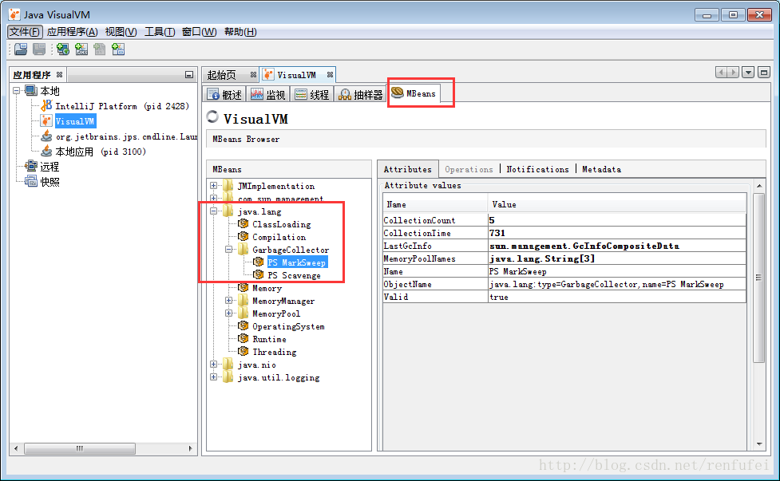
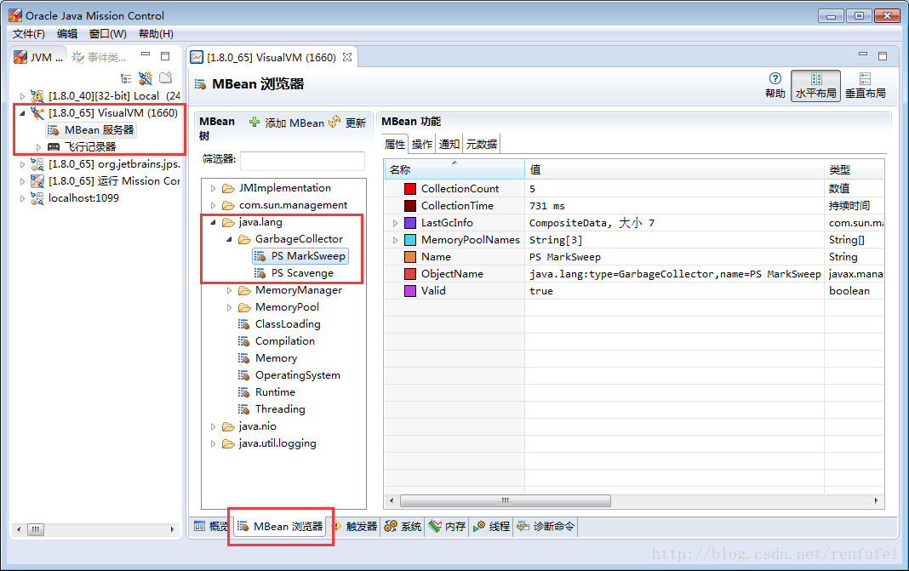
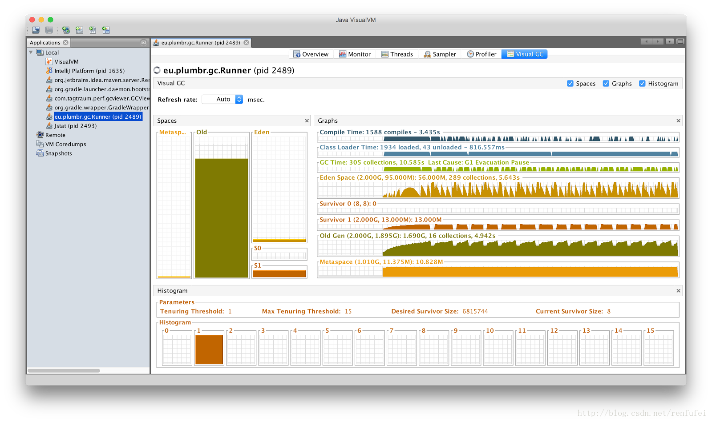
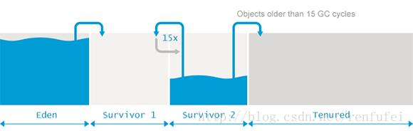

## JVM参数调优整理

#### 1.调优工具

###### JVisualVM 和 JConsole

	以上两个工具都市JDK自带的，在JDK安装目录下就可以找到对应的exe可执行文件

###### 通过 JVisualVM 连接到某个JVM以后, 切换到 MBeans 标签, 展开 “java.lang/GarbageCollector” . 就可以看到GC行为信息, 下图是 JVisualVM 中的截图:

###### 下图是Java Mission Control 中的截图:

###### 从以上截图中可以看到两款垃圾收集器。其中一款负责清理年轻代(PS Scavenge)，另一款负责清理老年代(PS MarkSweep); 列表中显示的就是垃圾收集器的名称。可以看到 , jmc 的功能和展示数据的方式更强大

	对所有的垃圾收集器, 通过 JMX API 获取的信息包括:
		CollectionCount : 垃圾收集器执行的GC总次数,
		CollectionTime: 收集器运行时间的累计。这个值等于所有GC事件持续时间的总和,
		LastGcInfo: 最近一次GC事件的详细信息。包括 GC事件的持续时间(duration), 开始时间(startTime) 和 结束时间(endTime), 以及各个内存池在最近一次GC之前和之后的使用情况,
		MemoryPoolNames: 各个内存池的名称,
		Name: 垃圾收集器的名称
		ObjectName: 由JMX规范定义的 MBean的名字,
		Valid: 此收集器是否有效。本人只见过 “true“的情况 (^_^)
		根据经验, 这些信息对GC的性能来说,不能得出什么结论. 只有编写程序, 获取GC相关的 JMX 信息来进行统计和分析。 在下文可以看到, 一般也不怎么关注 MBean , 但 MBean 对于理解GC的原理倒是挺有用的。

#### JVisualVM

###### Visual GC 插件常用来监控本机运行的Java程序, 比如开发者和性能调优专家经常会使用此插件, 以快速获取程序运行时的GC信息

###### 左侧的图表展示了各个内存池的使用情况: Metaspace/永久代, 老年代, Eden区以及两个存活区。
###### 在右边, 顶部的两个图表与 GC无关, 显示的是 JIT编译时间 和 类加载时间。下面的6个图显示的是内存池的历史记录, 每个内存池的GC次数,GC总时间, 以及最大值，峰值, 当前使用情况。

#### jstat

###### jstat 也是标准JDK提供的一款监控工具(Java Virtual Machine statistics monitoring tool),可以统计各种指标。既可以连接到本地JVM,也可以连到远程JVM. 查看支持的指标和对应选项可以执行 “jstat -options” 。例如:

|     Option      |                          Displays...                          |
------------|-------------- |
|class            | Statistics on the behavior of the class loader                |
|compiler         | Statistics  on  the behavior of the HotSpot Just-In-Time com- |
|                 | piler                                                         |
|gc               | Statistics on the behavior of the garbage collected heap      |
|gccapacity       | Statistics of the capacities of  the  generations  and  their |
|                 | corresponding spaces.                                         |
|gccause          | Summary  of  garbage collection statistics (same as -gcutil), |
|                 | with the cause  of  the  last  and  current  (if  applicable) |
|                 | garbage collection events.                                    |
|gcnew            | Statistics of the behavior of the new generation.             |
|gcnewcapacity    | Statistics of the sizes of the new generations and its corre- |
|                 | sponding spaces.                                              |
|gcold            | Statistics of the behavior of the old and  permanent  genera- |
|                 | tions.                                                        |
|gcoldcapacity    | Statistics of the sizes of the old generation.                |
|gcpermcapacity   | Statistics of the sizes of the permanent generation.          |
|gcutil           | Summary of garbage collection statistics.                     |
|printcompilation | Summary of garbage collection statistics.                     |

###### jstat 对于快速确定GC行为是否健康非常有用。启动方式为: “jstat -gc -t PID 1s” , 其中,PID 就是要监视的Java进程ID。可以通过 jps 命令查看正在运行的Java进程列表。

	jps
    jstat -gc -t 2428 1s

###### 以上命令的结果, 是 jstat 每秒向标准输出输出一行新内容, 比如:

Timestamp | S0C  |  S1C  |  S0U  |  S1U   |   EC   |    EU   |     OC    |     OU   |    MC  |   MU  |  CCSC  | CCSU  | YGC |    YGCT  |  FGC  |  FGCT   |  GCT
----------|------|-------|--|--|-|--|--|--|--|--|--|--|--|--|--|--|--|
200.0 | 8448.0 | 8448.0 | 8448.0 | 0.0 |  67712.0 | 67712.0 | 169344.0 |  169344.0 | 21248.0 | 20534.3 | 3072.0 | 2807.7  | 34 | 0.720 | 658 | 133.684 | 134.404
201.0 | 8448.0 | 8448.0 | 8448.0 | 0.0 |  67712.0 | 67712.0 | 169344.0 |  169343.2 | 21248.0 | 20534.3 | 3072.0 | 2807.7  | 34 | 0.720 | 662 | 134.712 | 135.432
202.0 | 8448.0 | 8448.0 | 8102.5 | 0.0 |  67712.0 | 67598.5 | 169344.0 |  169343.6 | 21248.0 | 20534.3 | 3072.0 | 2807.7  | 34 | 0.720 | 667 | 135.840 | 136.559
203.0 | 8448.0 | 8448.0 | 8126.3 | 0.0 |  67712.0 | 67702.2 | 169344.0 |  169343.6 | 21248.0 | 20547.2 | 3072.0 | 2807.7  | 34 | 0.720 | 669 | 136.178 | 136.898
204.0 | 8448.0 | 8448.0 | 8126.3 | 0.0 |  67712.0 | 67702.2 | 169344.0 |  169343.6 | 21248.0 | 20547.2 | 3072.0 | 2807.7  | 34 | 0.720 | 669 | 136.178 | 136.898
205.0 | 8448.0 | 8448.0 | 8134.6 | 0.0 |  67712.0 | 67712.0 | 169344.0 |  169343.5 | 21248.0 | 20547.2 | 3072.0 | 2807.7  | 34 | 0.720 | 671 | 136.234 | 136.954
206.0 | 8448.0 | 8448.0 | 8134.6 | 0.0 |  67712.0 | 67712.0 | 169344.0 |  169343.5 | 21248.0 | 20547.2 | 3072.0 | 2807.7  | 34 | 0.720 | 671 | 136.234 | 136.954
207.0 | 8448.0 | 8448.0 | 8154.8 | 0.0 |  67712.0 | 67712.0 | 169344.0 |  169343.5 | 21248.0 | 20547.2 | 3072.0 | 2807.7  | 34 | 0.720 | 673 | 136.289 | 137.009
208.0 | 8448.0 | 8448.0 | 8154.8 | 0.0 |  67712.0 | 67712.0 | 169344.0 |  169343.5 | 21248.0 | 20547.2 | 3072.0 | 2807.7  | 34 | 0.720 | 673 | 136.289 | 137.009

###### 稍微解释一下上面的内容。参考 jstat manpage , 我们可以知道:

- jstat 连接到 JVM 的时间, 是JVM启动后的 200秒。此信息从第一行的 “Timestamp” 列得知。继续看下一行, jstat 每秒钟从JVM 接收一次信息, 也就是命令行参数中 “1s” 的含义

- 从第一行的 “YGC” 列得知年轻代共执行了34次GC, 由 “FGC” 列得知整个堆内存已经执行了 658次 full GC

- 年轻代的GC耗时总共为 0.720 秒, 显示在“YGCT” 这一列

- Full GC 的总计耗时为 133.684 秒, 由“FGCT”列得知。 这立马就吸引了我们的目光, 总的JVM 运行时间只有 200 秒, 但其中有 66% 的部分被 Full GC 消耗了

###### 再看下一行, 问题就更明显了。

- 在201秒的时候，一秒内共执行了 4 次 Full GC。参见 “FGC” 列

- 这4次 Full GC 暂停占用了差不多 1秒的时间(根据 FGCT列的差得知)。与第一行相比, Full GC 耗费了928 毫秒, 即 92.8% 的时间

- 根据 “OC 和 “OU” 列得知, 整个老年代的空间为 169,344.0 KB (“OC“), 在 4 次 Full GC 后依然占用了 169,344.2 KB (“OU“)。用了 928ms 的时间却只释放了 800 字节的内存, 怎么看都觉得很不正常

###### 只看这两行的内容, 就知道程序出了很严重的问题。继续分析下一行, 可以确定问题依然存在,而且变得更糟

###### JVM几乎完全卡住了(stalled), 因为GC占用了90%以上的计算资源。GC之后, 所有的老代空间仍然还在占用。事实上, 程序在一分钟以后就挂了, 抛出了 “java.lang.OutOfMemoryError: GC overhead limit exceeded” 错误

##### 可以看到, 通过 jstat 能很快发现对JVM健康极为不利的GC行为。一般来说, 只看 jstat 的输出就能快速发现以下问题

- 最后一列 “GCT”, 与JVM的总运行时间 “Timestamp” 的比值, 就是GC 的开销。如果每一秒内, “GCT” 的值都会明显增大, 与总运行时间相比, 就暴露出GC开销过大的问题. 不同系统对GC开销有不同的容忍度, 由性能需求决定, 一般来讲, 超过 10% 的GC开销都是有问题的

- “YGC” 和 “FGC” 列的快速变化往往也是有问题的征兆。频繁的GC暂停会累积,并导致更多的线程停顿(stop-the-world pauses), 进而影响吞吐量

- 如果看到 “OU” 列中,老年代的使用量约等于老年代的最大容量(OC), 并且不降低的话, 就表示虽然执行了老年代GC, 但基本上属于无效GC

#### 2.GC日志(GC logs)

###### 通过日志内容也可以得到GC相关的信息。因为GC日志模块内置于JVM中, 所以日志中包含了对GC活动最全面的描述。 这就是事实上的标准, 可作为GC性能评估和优化的最真实数据来源
###### GC日志一般输出到文件之中, 是纯 text 格式的, 当然也可以打印到控制台。有多个可以控制GC日志的JVM参数。例如,可以打印每次GC的持续时间, 以及程序暂停时间(-XX:+PrintGCApplicationStoppedTime), 还有GC清理了多少引用类型(-XX:+PrintReferenceGC)

###### 要打印GC日志, 需要在启动脚本中指定以下参数:
	-XX:+PrintGCTimeStamps -XX:+PrintGCDateStamps -XX:+PrintGCDetails -Xloggc:<filename>

###### 以上参数指示JVM: 将所有GC事件打印到日志文件中, 输出每次GC的日期和时间戳。不同GC算法输出的内容略有不同
###### ParallelGC 输出的日志类似这样:

199.879 | [Full GC (Ergonomics)| [PSYoungGen: 64000K->63998K(74240K)]| [ParOldGen: 169318K->169318K(169472K)]| 233318K->233317K(243712K),| [Metaspace: 20427K->20427K(1067008K)], 0.1473386 secs] |[Times: user=0.43 sys=0.01, real=0.15 secs]
--------|---------------|----------|--------------|----|----|---|
200.027 | [Full GC (Ergonomics)| [PSYoungGen: 64000K->63998K(74240K)] | [ParOldGen: 169318K->169318K(169472K)] | 233318K->233317K(243712K),| [Metaspace: 20427K->20427K(1067008K)], 0.1567794 secs] | [Times: user=0.41 sys=0.00, real=0.16 secs]
200.184 | [Full GC (Ergonomics)| [PSYoungGen: 64000K->63998K(74240K)] | [ParOldGen: 169318K->169318K(169472K)] | 233318K->233317K(243712K),| [Metaspace: 20427K->20427K(1067008K)], 0.1621946 secs] | [Times: user=0.43 sys=0.00, real=0.16 secs]
200.346 | [Full GC (Ergonomics)| [PSYoungGen: 64000K->63998K(74240K)] | [ParOldGen: 169318K->169318K(169472K)] | 233318K->233317K(243712K),| [Metaspace: 20427K->20427K(1067008K)], 0.1547695 secs] | [Times: user=0.41 sys=0.00, real=0.15 secs]
200.502 | [Full GC (Ergonomics)| [PSYoungGen: 64000K->63999K(74240K)] | [ParOldGen: 169318K->169318K(169472K)] | 233318K->233317K(243712K),| [Metaspace: 20427K->20427K(1067008K)], 0.1563071 secs] | [Times: user=0.42 sys=0.01, real=0.16 secs]
200.659 | [Full GC (Ergonomics)| [PSYoungGen: 64000K->63999K(74240K)] | [ParOldGen: 169318K->169318K(169472K)] | 233318K->233317K(243712K),| [Metaspace: 20427K->20427K(1067008K)], 0.1538778 secs] | [Times: user=0.42 sys=0.00, real=0.16 secs]

###### 分析以上日志内容, 可以得知:

- 这部分日志截取自JVM启动后200秒左右

- 日志片段中显示, 在780毫秒以内, 因为垃圾回收 导致了5次 Full GC 暂停(去掉第六次暂停,这样更精确一些)

- 在GC完成之后, 几乎所有的老年代空间(169,472 KB)依然被占用(169,318 KB)

##### 通过日志信息可以确定, 该应用的GC情况非常糟糕。JVM几乎完全停滞, 因为GC占用了超过99%的CPU时间。 而GC的结果是, 老年代空间仍然被占满, 这进一步肯定了我们的结论。 示例程序和jstat 小节中的是同一个, 几分钟之后系统就挂了, 抛出 “java.lang.OutOfMemoryError: GC overhead limit exceeded” 错误, 不用说, 问题是很严重的

###### 从此示例可以看出, GC日志对监控GC行为和JVM是否处于健康状态非常有用。一般情况下, 查看 GC 日志就可以快速确定以下症状:
- GC开销太大。如果GC暂停的总时间很长, 就会损害系统的吞吐量。不同的系统允许不同比例的GC开销, 但一般认为, 正常范围在 10% 以内

- 老年代的使用量超过限制。如果老年代空间在 Full GC 之后仍然接近全满, 那么GC就成为了性能瓶颈, 可能是内存太小, 也可能是存在内存泄漏。这种症状会让GC的开销暴增

- 极个别的GC事件暂停时间过长。当某次GC暂停时间太长, 就会影响系统的延迟指标. 如果延迟指标规定交易必须在 1,000 ms内完成, 那就不能容忍任何超过 1000毫秒的GC暂停

####  3.高分配速率(High Allocation Rate)

	分配速率(Allocation rate)表示单位时间内分配的内存量。通常使用 MB/sec作为单位, 也可以使用 PB/year 等。
	分配速率过高就会严重影响程序的性能。在JVM中会导致巨大的GC开销。

###### 如何测量分配速率?

###### 指定JVM参数: -XX:+PrintGCDetails -XX:+PrintGCTimeStamps , 通过GC日志来计算分配速率. GC日志如下所示:

	0.291: [GC (Allocation Failure)
        [PSYoungGen: 33280K->5088K(38400K)]
        33280K->24360K(125952K), 0.0365286 secs]
    	[Times: user=0.11 sys=0.02, real=0.04 secs]
	0.446: [GC (Allocation Failure)
        [PSYoungGen: 38368K->5120K(71680K)]
        57640K->46240K(159232K), 0.0456796 secs]
    	[Times: user=0.15 sys=0.02, real=0.04 secs]
	0.829: [GC (Allocation Failure)
        [PSYoungGen: 71680K->5120K(71680K)]
        112800K->81912K(159232K), 0.0861795 secs]
    	[Times: user=0.23 sys=0.03, real=0.09 secs]

###### 计算 上一次垃圾收集之后,与下一次GC开始之前的年轻代使用量, 两者的差值除以时间,就是分配速率。 通过上面的日志, 可以计算出以下信息:

- JVM启动之后 291ms, 共创建了 33,280 KB 的对象。 第一次 Minor GC(小型GC) 完成后, 年轻代中还有 5,088 KB 的对象存活。

- 在启动之后 446 ms, 年轻代的使用量增加到 38,368 KB, 触发第二次GC, 完成后年轻代的使用量减少到 5,120 KB。

- 在启动之后 829 ms, 年轻代的使用量为 71,680 KB, GC后变为 5,120 KB。

###### 可以通过年轻代的使用量来计算分配速率, 如下表所示:

Event | Time | Young before | Young after | Allocated during | Allocation rate
------|-------|---------------|---------------|---------------|-----------------
1st GC | 291ms | 33,280KB | 5,088KB | 33,280KB | 114MB/sec
2nd GC | 446ms | 38,368KB | 5,120KB | 33,280KB | 215MB/sec
3rd GC | 829ms | 71,680KB | 5,120KB | 66,560KB | 174MB/sec
Total  | 829ms | N/A | N/A | 133,120KB | 161MB/sec

#### 4.分配速率的意义
		分配速率的变化,会增加或降低GC暂停的频率, 从而影响吞吐量。 但只有年轻代的 minor GC 受分配速率的影响, 老年代GC的频率和持续时间不受 分配速率(allocation rate)的直接影响, 而是受到 提升速率(promotion rate)的影响, 请参见下文

		现在我们只关心 Minor GC 暂停, 查看年轻代的3个内存池。因为对象在 Eden区分配, 所以我们一起来看 Eden 区的大小和分配速率的关系. 看看增加 Eden 区的容量, 能不能减少 Minor GC 暂停次数, 从而使程序能够维持更高的分配速率。

###### 经过我们的实验, 通过参数 -XX:NewSize、 -XX:MaxNewSize 以及 -XX:SurvivorRatio 设置不同的 Eden 空间, 运行同一程序时, 可以发现:

- Eden 空间为 100 MB 时, 分配速率低于 100 MB/秒
- 将 Eden 区增大为 1 GB, 分配速率也随之增长,大约等于 200 MB/秒

#### 为什么会这样? —— 因为减少GC暂停,就等价于减少了任务线程的停顿，就可以做更多工作, 也就创建了更多对象, 所以对同一应用来说, 分配速率越高越好

	在得出 “Eden区越大越好” 这个结论前, 我们注意到, 分配速率可能会,也可能不会影响程序的实际吞吐量。 吞吐量和分配速率有一定关系, 因为分配速率会影响 minor GC 暂停, 但对于总体吞吐量的影响, 还要考虑 Major GC(大型GC)暂停, 而且吞吐量的单位不是 MB/秒， 而是系统所处理的业务量。

#### 5.高分配速率对JVM的影响

###### 首先，我们应该检查程序的吞吐量是否降低。如果创建了过多的临时对象, minor GC的次数就会增加。如果并发较大, 则GC可能会严重影响吞吐量
###### 遇到这种情况时, GC日志将会像下面这样，当然这是上面的示例程序 产生的GC日志。 JVM启动参数为
	-XX:+PrintGCDetails -XX:+PrintGCTimeStamps -Xmx32m
时间|GC情况
------------------------------|--------------------------------
2.808: [GC (Allocation Failure) | [PSYoungGen: 9760K->32K(10240K)], 0.0003076 secs]
2.819: [GC (Allocation Failure) | [PSYoungGen: 9760K->32K(10240K)], 0.0003079 secs]
2.830: [GC (Allocation Failure) | [PSYoungGen: 9760K->32K(10240K)], 0.0002968 secs]
2.842: [GC (Allocation Failure) | [PSYoungGen: 9760K->32K(10240K)], 0.0003374 secs]
2.853: [GC (Allocation Failure) | [PSYoungGen: 9760K->32K(10240K)], 0.0004672 secs]
2.864: [GC (Allocation Failure) | [PSYoungGen: 9760K->32K(10240K)], 0.0003371 secs]
2.875: [GC (Allocation Failure) | [PSYoungGen: 9760K->32K(10240K)], 0.0003214 secs]
2.886: [GC (Allocation Failure) | [PSYoungGen: 9760K->32K(10240K)], 0.0003374 secs]
2.896: [GC (Allocation Failure) | [PSYoungGen: 9760K->32K(10240K)], 0.0003588 secs]

** 很显然 minor GC 的频率太高了。这说明创建了大量的对象。另外, 年轻代在 GC 之后的使用量又很低, 也没有 full GC 发生。 种种迹象表明, GC对吞吐量造成了严重的影响 **

#### 解决方案

###### 在某些情况下,只要增加年轻代的大小, 即可降低分配速率过高所造成的影响。增加年轻代空间并不会降低分配速率, 但是会减少GC的频率。如果每次GC后只有少量对象存活, minor GC 的暂停时间就不会明显增加

###### 运行 示例程序 时, 增加堆内存大小,(同时也就增大了年轻代的大小), 使用的JVM参数为 -Xmx64m:
时间 							 | 					GC情况
------------------------------|--------------------------------
2.808: [GC (Allocation Failure) | [PSYoungGen: 20512K->32K(20992K)], 0.0003748 secs]
2.831: [GC (Allocation Failure) | [PSYoungGen: 20512K->32K(20992K)], 0.0004538 secs]
2.855: [GC (Allocation Failure) | [PSYoungGen: 20512K->32K(20992K)], 0.0003355 secs]
2.879: [GC (Allocation Failure) | [PSYoungGen: 20512K->32K(20992K)], 0.0005592 secs]

###### ** 但有时候增加堆内存的大小,并不能解决问题。通过前面学到的知识, 我们可以通过分配分析器找出大部分垃圾产生的位置。实际上在此示例中, 99%的对象属于 Double 包装类, 在readSensor 方法中创建。最简单的优化, 将创建的 Double 对象替换为原生类型 double, 而针对 null 值的检测, 可以使用 Double.NaN 来进行。由于原生类型不算是对象, 也就不会产生垃圾, 导致GC事件。优化之后, 不在堆中分配新对象, 而是直接覆盖一个属性域即可 **

###### ** 对示例程序进行[简单的改造](https://github.com/gvsmirnov/java-perv/blob/master/labs-8/src/main/java/ru/gvsmirnov/perv/labs/gc/FixedBoxing.java)( [查看diff](https://gist.github.com/gvsmirnov/0270f0f15f9498e3b655) ) 后, GC暂停基本上完全消除。有时候 JVM 也很智能, 会使用 逃逸分析技术(escape analysis technique) 来避免过度分配。简单来说,JIT编译器可以通过分析得知, 方法创建的某些对象永远都不会“逃出”此方法的作用域。这时候就不需要在堆上分配这些对象, 也就不会产生垃圾, 所以JIT编译器的一种优化手段就是: 消除内存分配。请参考 [基准测试](https://github.com/gvsmirnov/java-perv/blob/master/labs-8/src/main/java/ru/gvsmirnov/perv/labs/jit/EscapeAnalysis.java) **

#### 过早提升

###### 提升速率(promotion rate), 用于衡量单位时间内从年轻代提升到老年代的数据量。一般使用 MB/sec 作为单位, 和分配速率类似

###### JVM会将长时间存活的对象从年轻代提升到老年代。根据分代假设, 可能存在一种情况, 老年代中不仅有存活时间长的对象,也可能有存活时间短的对象。这就是过早提升：对象存活时间还不够长的时候就被提升到了老年代

###### major GC 不是为频繁回收而设计的, 但 major GC 现在也要清理这些生命短暂的对象, 就会导致GC暂停时间过长。这会严重影响系统的吞吐量

#### 如何测量提升速率

###### ** 可以指定JVM参数 -XX:+PrintGCDetails -XX:+PrintGCTimeStamps , 通过GC日志来测量提升速率. JVM记录的GC暂停信息如下所示 **

时间 | GC情况
---------------------------------|-------------------------------
0.291: [GC (Allocation Failure) | [PSYoungGen: 33280K->5088K(38400K)] 33280K->24360K(125952K), 0.0365286 secs] [Times: user=0.11 sys=0.02, real=0.04 secs]
0.446: [GC (Allocation Failure) | [PSYoungGen: 38368K->5120K(71680K)] 57640K->46240K(159232K), 0.0456796 secs] [Times: user=0.15 sys=0.02, real=0.04 secs]
0.829: [GC (Allocation Failure) | [PSYoungGen: 71680K->5120K(71680K)] 112800K->81912K(159232K), 0.0861795 secs] [Times: user=0.23 sys=0.03, real=0.09 secs]

** 从上面的日志可以得知： GC之前和之后的 年轻代使用量以及堆内存使用量。这样就可以通过差值算出老年代的使用量。GC日志中的信息可以表述为: **

Event |  Time |  Young decreased |  Total decreased |  Promoted |  Promotion rate
------|-------|----------------|----------------|---------|---------------
(事件) |  (耗时) |  (年轻代减少) |  (整个堆内存减少) |  (提升量) |  (提升速率)
1st GC |  291ms |  28,192K |  8,920K  |  19,272K |  66.2 MB/sec
2nd GC |  446ms |  33,248K |  11,400K |  21,848K |  140.95 MB/sec
3rd GC |  829ms |  66,560K |  30,888K |  35,672K |  93.14 MB/sec
Total |  829ms  |   ------ |  ------  | 76,792K  | 92.63 MB/sec

** 根据这些信息, 就可以计算出观测周期内的提升速率。平均提升速率为 92 MB/秒, 峰值为 140.95 MB/秒 **

###### ** 请注意, 只能根据 minor GC 计算提升速率。 Full GC 的日志不能用于计算提升速率, 因为 major GC 会清理掉老年代中的一部分对象。 **

#### 提升速率的意义

** 和分配速率一样, 提升速率也会影响GC暂停的频率。但分配速率主要影响 minor GC, 而提升速率则影响 major GC 的频率。有大量的对象提升,自然很快将老年代填满。 老年代填充的越快, 则 major GC 事件的频率就会越高 **

###### 此前说过, full GC 通常需要更多的时间, 因为需要处理更多的对象, 还要执行碎片整理等额外的复杂过程

#### 示例
###### 让我们看一个[过早提升的示例](https://github.com/gvsmirnov/java-perv/blob/master/labs-8/src/main/java/ru/gvsmirnov/perv/labs/gc/PrematurePromotion.java)。 这个程序创建/获取大量的对象/数据,并暂存到集合之中, 达到一定数量后进行批处理:

	public class PrematurePromotion {

   	private static final Collection<byte[]> accumulatedChunks
                = new ArrayList<>();

   	private static void onNewChunk(byte[] bytes) {
       accumulatedChunks.add(bytes);

       	if(accumulatedChunks.size() > MAX_CHUNKS) {
           	processBatch(accumulatedChunks);
           	accumulatedChunks.clear();
       	}
   	}
	}

#### 过早提升的影响

###### 一般来说,过早提升的症状表现为以下形式:

- 短时间内频繁地执行 full GC。
- 每次 full GC 后老年代的使用率都很低, 在10-20%或以下
- 提升速率接近于分配速率

###### ** 要演示这种情况稍微有点麻烦, 所以我们使用特殊手段, 让对象提升到老年代的年龄比默认情况小很多。指定GC参数 -Xmx24m -XX:NewSize=16m -XX:MaxTenuringThreshold=1, 运行程序之后,可以看到下面的GC日志: **

时间 | GC情况
-------------------------------------------------|------------------------------------------------------------------------
2.176: [Full GC (Ergonomics) | [PSYoungGen: 9216K->0K(10752K)] [ParOldGen: 10020K->9042K(12288K)] 19236K->9042K(23040K), 0.0036840 secs]
2.394: [Full GC (Ergonomics) | [PSYoungGen: 9216K->0K(10752K)] [ParOldGen: 9042K->8064K(12288K)] 18258K->8064K(23040K), 0.0032855 secs]
2.611: [Full GC (Ergonomics) | [PSYoungGen: 9216K->0K(10752K)] [ParOldGen: 8064K->7085K(12288K)] 17280K->7085K(23040K), 0.0031675 secs]
2.817: [Full GC (Ergonomics) | [PSYoungGen: 9216K->0K(10752K)] [ParOldGen: 7085K->6107K(12288K)] 16301K->6107K(23040K), 0.0030652 secs]

** 乍一看似乎不是过早提升的问题。事实上,在每次GC之后老年代的使用率似乎在减少。但反过来想, 要是没有对象提升或者提升率很小, 也就不会看到这么多的 Full GC 了。 **
** 简单解释一下这里的GC行为: 有很多对象提升到老年代, 同时老年代中也有很多对象被回收了, 这就造成了老年代使用量减少的假象. 但事实是大量的对象不断地被提升到老年代, 并触发 full GC。 **

#### 解决方案

###### 简单来说, 要解决这类问题, 需要让年轻代存放得下暂存的数据。有两种简单的方法:

###### 一是增加年轻代的大小, 设置JVM启动参数, 类似这样: -Xmx64m -XX:NewSize=32m, 程序在执行时, Full GC 的次数自然会减少很多, 只会对 minor GC的持续时间产生影响:

时间 | GC情况
-------------------------------------------------|------------------------------------------------------------------------
3.2.251: [GC (Allocation Failure) | [PSYoungGen: 28672K->3872K(28672K)] 37126K->12358K(61440K), 0.0008543 secs]
2.776: [GC (Allocation Failure)   | [PSYoungGen: 28448K->4096K(28672K)] 36934K->16974K(61440K), 0.0033022 secs]

###### 二是减少每次批处理的数量, 也能得到类似的结果. 至于选用哪个方案, 要根据业务需求决定。在某些情况下, 业务逻辑不允许减少批处理的数量, 那就只能增加堆内存,或者重新指定年轻代的大小

** 如果都不可行, 就只能优化数据结构, 减少内存消耗。但总体目标依然是一致的: 让临时数据能够在年轻代存放得下 **

#### 6.Weak, Soft 及 Phantom 引用

###### 另一类影响GC的问题是程序中的 non-strong 引用。虽然这类引用在很多情况下可以避免出现 OutOfMemoryError, 但过量使用也会对GC造成严重的影响, 反而降低系统性能

#### 弱引用的缺点

###### 首先, 弱引用(weak reference) 是可以被GC强制回收的。当垃圾收集器发现一个弱可达对象(weakly reachable,即指向该对象的引用只剩下弱引用) 时, 就会将其置入相应的ReferenceQueue 中, 变成可终结的对象. 之后可能会遍历这个 reference queue, 并执行相应的清理。典型的示例是清除缓存中不再引用的KEY。

###### 当然, 在这个时候, 我们还可以将该对象赋值给新的强引用, 在最后终结和回收前, GC会再次确认该对象是否可以安全回收。因此, 弱引用对象的回收过程是横跨多个GC周期的。

###### 实际上弱引用使用的很多。大部分缓存框架(caching solution)都是基于弱引用实现的, 所以虽然业务代码中没有直接使用弱引用, 但程序中依然会大量存在

###### 其次, 软引用(soft reference) 比弱引用更难被垃圾收集器回收. 回收软引用没有确切的时间点, 由JVM自己决定. 一般只会在即将耗尽可用内存时, 才会回收软引用,以作最后手段。这意味着, 可能会有更频繁的 full GC, 暂停时间也比预期更长, 因为老年代中的存活对象会很多。

###### 最后, 使用虚引用(phantom reference)时, 必须手动进行内存管理, 以标识这些对象是否可以安全地回收。表面上看起来很正常, 但实际上并不是这样。 javadoc 中写道:

	In order to ensure that a reclaimable object remains so, the referent of a phantom reference may not be retrieved: The get method of a phantom reference always returns null.

	为了防止可回收对象的残留, 虚引用对象不应该被获取: phantom reference 的 get 方法返回值永远是 null。

###### 令人惊讶的是, 很多开发者忽略了下一段内容(这才是重点):

###### Unlike soft and weak references, phantom references are not automatically cleared by the garbage collector as they are enqueued. An object that is reachable via phantom references will remain so until all such references are cleared or themselves become unreachable.

	与软引用和弱引用不同, 虚引用不会被 GC 自动清除, 因为他们被存放到队列中. 通过虚引用可达的对象会继续留在内存中, 直到调用此引用的 clear 方法, 或者引用自身变为不可达。

#### 示例

###### ** 让我们看一个[弱引用示例](https://github.com/gvsmirnov/java-perv/blob/master/labs-8/src/main/java/ru/gvsmirnov/perv/labs/gc/WeakReferences.java), 其中创建了大量的对象, 并在 minor GC 中完成回收。和前面一样, 修改提升阀值。使用的JVM参数为: **

	2.330: [GC (Allocation Failure)  20933K->8229K(22528K), 0.0033848 secs]
	2.335: [GC (Allocation Failure)  20517K->7813K(22528K), 0.0022426 secs]
	2.339: [GC (Allocation Failure)  20101K->7429K(22528K), 0.0010920 secs]
	2.341: [GC (Allocation Failure)  19717K->9157K(22528K), 0.0056285 secs]
	2.348: [GC (Allocation Failure)  21445K->8997K(22528K), 0.0041313 secs]
	2.354: [GC (Allocation Failure)  21285K->8581K(22528K), 0.0033737 secs]
	2.359: [GC (Allocation Failure)  20869K->8197K(22528K), 0.0023407 secs]
	2.362: [GC (Allocation Failure)  20485K->7845K(22528K), 0.0011553 secs]
	2.365: [GC (Allocation Failure)  20133K->9501K(22528K), 0.0060705 secs]
	2.371: [Full GC (Ergonomics)  9501K->2987K(22528K), 0.0171452 secs]

###### ** 可以看到, Full GC 的次数很少。但如果使用弱引用来指向创建的对象, 使用JVM参数 -Dweak.refs=true, 则情况会发生明显变化. 使用弱引用的原因很多, 比如在 weak hash map 中将对象作为Key的情况。在任何情况下, 使用弱引用都可能会导致以下情形: **

	2.059: [Full GC (Ergonomics)  20365K->19611K(22528K), 0.0654090 secs]
	2.125: [Full GC (Ergonomics)  20365K->19711K(22528K), 0.0707499 secs]
	2.196: [Full GC (Ergonomics)  20365K->19798K(22528K), 0.0717052 secs]
	2.268: [Full GC (Ergonomics)  20365K->19873K(22528K), 0.0686290 secs]
	2.337: [Full GC (Ergonomics)  20365K->19939K(22528K), 0.0702009 secs]
	2.407: [Full GC (Ergonomics)  20365K->19995K(22528K), 0.0694095 secs]

###### ** 可以看到, 发生了多次 full GC, 比起前一节的示例, GC时间增加了一个数量级! 这是过早提升的另一个例子, 但这次情况更加棘手. 当然,问题的根源在于弱引用。这些临死的对象, 在添加弱引用之后, 被提升到了老年代。 但是, 他们现在陷入另一次GC循环之中, 所以需要对其做一些适当的清理。像之前一样, 最简单的办法是增加年轻代的大小, 例如指定JVM参数: -Xmx64m -XX:NewSize=32m: **

	2.328: [GC (Allocation Failure)  38940K->13596K(61440K), 0.0012818 secs]
	2.332: [GC (Allocation Failure)  38172K->14812K(61440K), 0.0060333 secs]
	2.341: [GC (Allocation Failure)  39388K->13948K(61440K), 0.0029427 secs]
	2.347: [GC (Allocation Failure)  38524K->15228K(61440K), 0.0101199 secs]
	2.361: [GC (Allocation Failure)  39804K->14428K(61440K), 0.0040940 secs]
	2.368: [GC (Allocation Failure)  39004K->13532K(61440K), 0.0012451 secs]

** 这时候, 对象在 minor GC 中就被回收了 **

###### 更坏的情况是使用软引用,例如这个[软引用示例程序](https://github.com/gvsmirnov/java-perv/blob/master/labs-8/src/main/java/ru/gvsmirnov/perv/labs/gc/SoftReferences.java)。如果程序不是即将发生 OutOfMemoryError , 软引用对象就不会被回收. 在示例程序中,用软引用替代弱引用, 立即出现了更多的 Full GC 事件:

	2.162: [Full GC (Ergonomics)  31561K->12865K(61440K), 0.0181392 secs]
	2.184: [GC (Allocation Failure)  37441K->17585K(61440K), 0.0024479 secs]
	2.189: [GC (Allocation Failure)  42161K->27033K(61440K), 0.0061485 secs]
	2.195: [Full GC (Ergonomics)  27033K->14385K(61440K), 0.0228773 secs]
	2.221: [GC (Allocation Failure)  38961K->20633K(61440K), 0.0030729 secs]
	2.227: [GC (Allocation Failure)  45209K->31609K(61440K), 0.0069772 secs]
	2.234: [Full GC (Ergonomics)  31609K->15905K(61440K), 0.0257689 secs]

###### 最有趣的是虚引用[示例中的虚引用](https://github.com/gvsmirnov/java-perv/blob/master/labs-8/src/main/java/ru/gvsmirnov/perv/labs/gc/PhantomReferences.java), 使用同样的JVM参数启动, 其结果和弱引用示例非常相似。实际上, full GC 暂停的次数会小得多, 原因前面说过, 他们有不同的终结方式。

###### 如果禁用虚引用清理, 增加JVM启动参数 (-Dno.ref.clearing=true), 则可以看到:

	4.180: [Full GC (Ergonomics)  57343K->57087K(61440K), 0.0879851 secs]
	4.269: [Full GC (Ergonomics)  57089K->57088K(61440K), 0.0973912 secs]
	4.366: [Full GC (Ergonomics)  57091K->57089K(61440K), 0.0948099 secs]

** main 线程中抛出异常 java.lang.OutOfMemoryError: Java heap space **

** 使用虚引用时要小心谨慎, 并及时清理虚可达对象。如果不清理, 很可能会发生 OutOfMemoryError. 请相信我们的经验教训: 处理 reference queue 的线程中如果没 catch 住 exception , 系统很快就会被整挂了 **

#### 使用非强引用的影响

** 建议使用JVM参数 -XX:+PrintReferenceGC 来看看各种引用对GC的影响. 如果将此参数用于启动 弱引用示例 , 将会看到: **

	2.173: [Full GC (Ergonomics)
        2.234: [SoftReference, 0 refs, 0.0000151 secs]
        2.234: [WeakReference, 2648 refs, 0.0001714 secs]
        2.234: [FinalReference, 1 refs, 0.0000037 secs]
        2.234: [PhantomReference, 0 refs, 0 refs, 0.0000039 secs]
        2.234: [JNI Weak Reference, 0.0000027 secs]
            [PSYoungGen: 9216K->8676K(10752K)]
            [ParOldGen: 12115K->12115K(12288K)]
            21331K->20792K(23040K),
        [Metaspace: 3725K->3725K(1056768K)],
        0.0766685 secs]
    [Times: user=0.49 sys=0.01, real=0.08 secs]
    2.250: [Full GC (Ergonomics)
        2.307: [SoftReference, 0 refs, 0.0000173 secs]
        2.307: [WeakReference, 2298 refs, 0.0001535 secs]
        2.307: [FinalReference, 3 refs, 0.0000043 secs]
        2.307: [PhantomReference, 0 refs, 0 refs, 0.0000042 secs]
        2.307: [JNI Weak Reference, 0.0000029 secs]
            [PSYoungGen: 9215K->8747K(10752K)]
            [ParOldGen: 12115K->12115K(12288K)]
            21331K->20863K(23040K),
        [Metaspace: 3725K->3725K(1056768K)],
        0.0734832 secs]
    [Times: user=0.52 sys=0.01, real=0.07 secs]
	2.323: [Full GC (Ergonomics)
        2.383: [SoftReference, 0 refs, 0.0000161 secs]
        2.383: [WeakReference, 1981 refs, 0.0001292 secs]
        2.383: [FinalReference, 16 refs, 0.0000049 secs]
        2.383: [PhantomReference, 0 refs, 0 refs, 0.0000040 secs]
        2.383: [JNI Weak Reference, 0.0000027 secs]
            [PSYoungGen: 9216K->8809K(10752K)]
            [ParOldGen: 12115K->12115K(12288K)]
            21331K->20925K(23040K),
        [Metaspace: 3725K->3725K(1056768K)],
        0.0738414 secs]
    [Times: user=0.52 sys=0.01, real=0.08 secs]

###### 只有确定 GC 对应用的吞吐量和延迟造成影响之后, 才应该花心思来分析这些信息, 审查这部分日志。通常情况下, 每次GC清理的引用数量都是很少的, 大部分情况下为 0。如果GC 花了较多时间来清理这类引用, 或者清除了很多的此类引用, 就需要进一步观察和分析了

#### 解决方案

** 如果程序确实碰到了 mis-, ab- 问题或者滥用 weak, soft, phantom 引用, 一般都要修改程序的实现逻辑。每个系统不一样, 因此很难提供通用的指导建议, 但有一些常用的办法: **

- 弱引用(Weak references) —— 如果某个内存池的使用量增大, 造成了性能问题, 那么增加这个内存池的大小(可能也要增加堆内存的最大容量)。如同示例中所看到的, 增加堆内存的大小, 以及年轻代的大小, 可以减轻症状。

- 虚引用(Phantom references) —— 请确保在程序中调用了虚引用的 clear 方法。编程中很容易忽略某些虚引用, 或者清理的速度跟不上生产的速度, 又或者清除引用队列的线程挂了, 就会对GC 造成很大压力, 最终可能引起 OutOfMemoryError。

- 软引用(Soft references) —— 如果确定问题的根源是软引用, 唯一的解决办法是修改程序源码, 改变内部实现逻辑。

#### 其他示例

** 前面介绍了最常见的GC性能问题。但我们学到的很多原理都没有具体的场景来展现。本节介绍一些不常发生, 但也可能会碰到的问题。 **

#### RMI 与 GC

###### 如果系统提供或者消费 RMI 服务, 则JVM会定期执行 full GC 来确保本地未使用的对象在另一端也不占用空间. 记住, 即使你的代码中没有发布 RMI 服务, 但第三方或者工具库也可能会打开 RMI 终端. 最常见的元凶是 JMX, 如果通过JMX连接到远端, 底层则会使用 RMI 发布数据

** 问题是有很多不必要的周期性 full GC。查看老年代的使用情况, 一般是没有内存压力, 其中还存在大量的空闲区域, 但 full GC 就是被触发了, 也就会暂停所有的应用线程 **

###### 这种周期性调用 System.gc() 删除远程引用的行为, 是在 sun.rmi.transport.ObjectTable 类中, 通过 sun.misc.GC.requestLatency(long gcInterval) 调用的

** 对许多应用来说, 根本没必要, 甚至对性能有害。 禁止这种周期性的 GC 行为, 可以使用以下 JVM 参数: **

	java -Dsun.rmi.dgc.server.gcInterval=9223372036854775807L
    -Dsun.rmi.dgc.client.gcInterval=9223372036854775807L
    com.yourcompany.YourApplication

** 这让 Long.MAX_VALUE 毫秒之后, 才调用 System.gc(), 实际运行的系统可能永远都不会触发。 **

	ObjectTable.class

#### 巨无霸对象的分配

###### 如果使用 G1 垃圾收集算法, 会产生一种巨无霸对象引起的 GC 性能问题

** 说明: 在G1中, 巨无霸对象是指所占空间超过一个小堆区(region) 50% 的对象 **

###### 频繁的创建巨无霸对象, 无疑会造成GC的性能问题, 看看G1的处理方式:

- 如果某个 region 中含有巨无霸对象, 则巨无霸对象后面的空间将不会被分配。如果所有巨无霸对象都超过某个比例, 则未使用的空间就会引发内存碎片问题。

- G1 没有对巨无霸对象进行优化。这在 JDK 8 以前是个特别棘手的问题 —— 在 Java 1.8u40 之前的版本中, 巨无霸对象所在 region 的回收只能在 full GC 中进行。最新版本的 Hotspot JVM, 在 marking 阶段之后的 cleanup 阶段中释放巨无霸区间, 所以这个问题在新版本JVM中的影响已大大降低。

###### ** 要监控是否存在巨无霸对象, 可以打开GC日志, 使用的命令如下: **

	java -XX:+PrintGCDetails -XX:+PrintGCTimeStamps
    -XX:+PrintReferenceGC -XX:+UseG1GC
    -XX:+PrintAdaptiveSizePolicy -Xmx128m
    MyClass

###### 这样的日志就是证据, 表明程序中确实创建了巨无霸对象. 可以看到: G1 Humongous Allocation 是 GC暂停的原因。 再看前面一点的 allocation request: 1048592 bytes , 可以发现程序试图分配一个 1,048,592 字节的对象, 这要比巨无霸区域(2MB)的 50% 多出 16 个字节。

###### 第一种解决方式, 是修改 region size , 以使得大多数的对象不超过 50%, 也就不进行巨无霸对象区域的分配。 region 的默认大小在启动时根据堆内存的大小算出。但也可以指定参数来覆盖默认设置, -XX:G1HeapRegionSize=XX。 指定的 region size 必须在 1~32MB 之间, 还必须是2的幂 【2^10 = 1024 = 1KB; 2^20=1MB; 所以 region size 只能是: 1m,2m,4m,8m,16m,32m】。

###### 这种方式也有副作用, 增加 region 的大小也就变相地减少了 region 的数量, 所以需要谨慎使用, 最好进行一些测试, 看看是否改善了吞吐量和延迟。

###### 更好的方式需要一些工作量, 如果可以的话, 在程序中限制对象的大小。最好是使用分析器, 展示出巨无霸对象的信息, 以及分配时所在的堆栈跟踪信息。

#### 总结

###### ** JVM上运行的程序多种多样, 启动参数也有上百个, 其中有很多会影响到 GC, 所以调优GC性能的方法也有很多种。 **

###### ** 还是那句话, 没有真正的银弹, 能满足所有的性能调优指标。 我们能做的只是介绍一些常见的/和不常见的示例, 让你在碰到类似问题时知道是怎么回事。深入理解GC的工作原理, 熟练应用各种工具, 就可以进行GC调优, 提高程序性能。 **

## 					打赏

