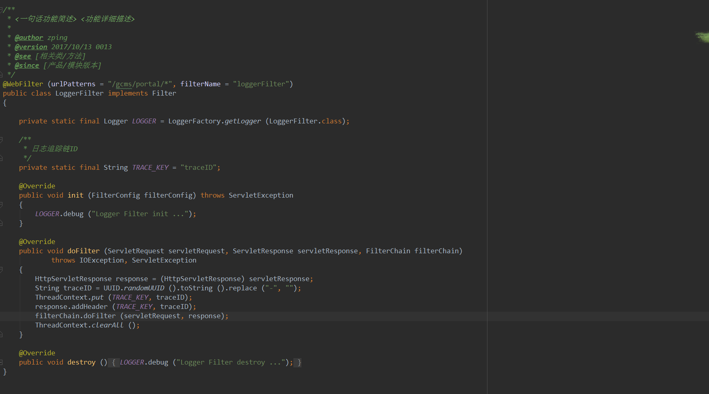
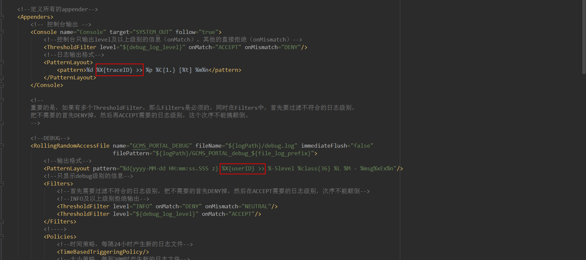
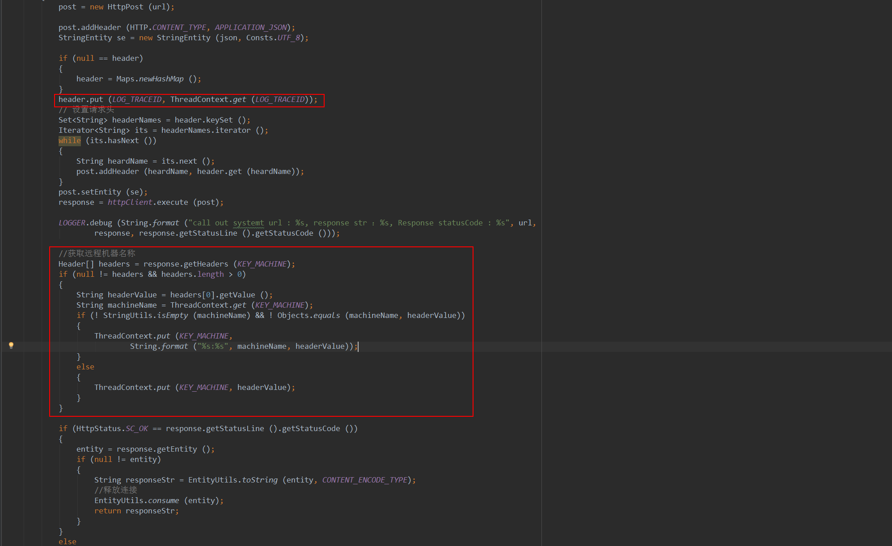
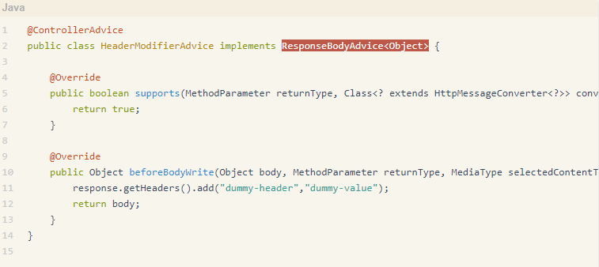

## Log4J2 日志链实现

###### 背景：
		日志是系统出现问题，最关键的信息，让开发人员快速找到日志信息，定位问题，我们需要有一个完整的日志系统，业界有ELK等日志系统，特别在分布式（微服务）中，日志就变得更加复杂，服务器资源多，日志打印开发无法快速找到日志信息在哪一台机器上，这时就需要我们记录日志的信息链路（路由），日志跟踪ID(TraceID)等信息，返回跟前端，开发通过查看接口就能快速找到日志信息方便定位问题。

###### 关键技术
	Log4j : MDC
    Log4j : ThreadContext

###### MDC介绍
		MDC（Mapped Diagnostic Context，映射调试上下文）是 log4j 和 logback 提供的一种方便在多线程条件下记录日志的功能。
    	MDC 可以看成是一个与当前线程绑定的哈希表，可以往其中添加键值对。MDC 中包含的内容可以被同一线程中执行的代码所访问。当前线程的子线程会继承其父线程中的 MDC 的内容。当需要记录日志时，只需要从 MDC 中获取所需的信息即可。MDC 的内容则由程序在适当的时候保存进去。对于一个 Web 应用来说，通常是在请求被处理的最开始保存这些数据。

###### ThreadContext 介绍

###### 线程上下文

		Log4j引入了映射诊断上下文或MDC的概念。已经在许多地方记录并讨论了 Log4j MDC和 Log4j以及映射诊断语境。此外，Log4j 1.x还提供对嵌套诊断环境或NDC的支持。它也已经在诸如Log4j NDC等不同地方进行了记录和讨论 。SLF4J / Logback之后，自己实现了MDC，这在Mapped Diagnostic Context中被很好地记录下来 。

#### 游戏平台实现方式

###### 1. 实现日志过滤器LogChainFilter

###### 2.修改Log4J打印日志信息

###### 3.记录日志路由信息

###### 4.清除日志上下文信息

## Spring Mvc 支持日志链实现

		日志实现同上，但是我们需要将TranceID添加到响应头当中，如果在每个接口方法中添加，会觉得很笨，最好能统一为接口请求添加。所以我们需要用到Spring Mvc的一个Controller的通知，动态加上去

## 实现方式
	编写一个接口实现ResponseBodyAdvice<Object>接口，添加注解@ControllerAdvice，此时该接口并成功注入为Controller层的切面通知，可以获取Response对象

## 					打赏

