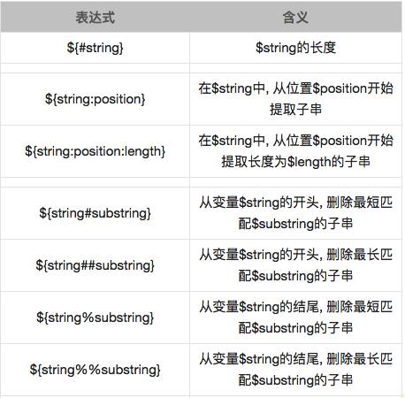
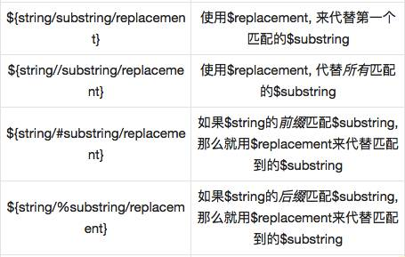

## SHELL指南

###### 使用Linux内置操作符字符串
表达式		  |			含义
------------|--------------
${var}		|变量var的值，与$var相同
${var:-DEFAULT} | 如果var 没有声明，或者为空那就以DEFAULT作为其值
${var=DEFAULT}  |如果var没有声明，那就以$DEFAULT作为其值
${var:=DEFAULT} | 如果var 没有声明，或者为空那就以DEFAULT作为其值
${var+DEFAULT}  |如果var声明了，那就以$DEFAULT作为其值，否则为NULL
${var:+DEFAULT} |如果var被设置了，那么其值就是$DEFAULT,否则为null
${var?ERR_MSG}  |如果var没有被声明，那就打印ERR_MSG值
${var:?ERR_MSG} |如果var没有被设置，那就打印ERR_MSG
${!varprefix*}  |匹配之前所有以varprefix开头进行声明的变量
${!varprefix@}  | 匹配之前所有以varprefix开头进行声明的变量

	[chengmo@ localhost ~]$ echo ${abc-'ok'}
    ok
    [chengmo@ localhost ~]$ echo $abc

    [chengmo@ localhost ~]$ echo ${abc='ok'}
    ok
    [chengmo@ localhost ~]$ echo $abc
    ok

###### 字符串操作（长度，读取，替换）

    1.长度
    [web97@salewell97 ~]$ test='I love china'
    [web97@salewell97 ~]$ echo ${#test}
    12
    ${#变量名}得到字符串长度

    2.截取字串
    [chengmo@ localhost ~]$ test='I love china'
    [chengmo@ localhost ~]$ echo ${test:5}
    e china
    [chengmo@ localhost ~]$ echo ${test:5:10}
    e china
    ${变量名:起始:长度}得到子字符串

    3.字符串删除
    [chengmo@ localhost ~]$ test='c:/windows/boot.ini'
    [chengmo@ localhost ~]$ echo ${test#/}
    c:/windows/boot.ini
    [chengmo@ localhost ~]$ echo ${test#*/}
    windows/boot.ini
    [chengmo@ localhost ~]$ echo ${test##*/}
    boot.ini
    [chengmo@ localhost ~]$ echo ${test%/*}
    c:/windows
    [chengmo@ localhost ~]$ echo ${test%%/*}
    ${变量名#substring正则表达式}从字符串开头开始配备substring,删除匹配上的表达式。
    ${变量名%substring正则表达式}从字符串结尾开始配备substring,删除匹配上的表达式。
    注意：${test##*/},${test%/*} 分别是得到文件名，或者目录地址最简单方法。

    4.字符串替换
    [chengmo@ localhost ~]$ test='c:/windows/boot.ini'
    [chengmo@ localhost ~]$ echo ${test/\//\\}
    c:\windows/boot.ini
    [chengmo@ localhost ~]$ echo ${test//\//\\}
    c:\windows\boot.ini

###### SHELL脚本中操作FTP，上传文件或者下载
###### 从ftp服务器上的/home/data 到 本地的/home/databackup

    #!/bin/bash
    ftp -n<<!
    open 192.168.1.171
    user guest 123456
    binary
    cd /home/data
    lcd /home/databackup
    prompt
    mget *
    close
    bye
    !

###### FTP自动登录上传文件

    #!/bin/bash
    ftp -n<<!
    open 192.168.1.171
    user guest 123456
    binary
    hash
    cd /home/data
    lcd /home/databackup
    prompt
    mput *
    close
    bye
    !

###### ftp自动登录下载单个文件
###### ftp服务器上下载/home/data/a.sh to local /home/databackup####
    #!/bin/bash
    ftp -n<<!
    open 192.168.1.171
    user guest 123456
    binary
    cd /home/data
    lcd /home/databackup
    prompt
    get a.sh a.sh
    close
    bye
    !

###### ftp自动登录上传单个文件
###### 把本地/home/databachup/a.sh up ftp /home/databackup 下
    #!/bin/bash
    ftp -n<<!
    open 192.168.1.171
    user guest 123456
    binary
    cd /home/data
    lcd /home/databackup
    prompt
    put a.sh a.sh
    close
    bye
    !
###### 注意：!是即时文件的标志它必须成对出现，以标识即时文件的开始和结尾。

###### SHELL执行ORACLE，导出数据
    sqlplus -s $DB_USER/$DB_PWD@$DB_SERV<<EOF >/dev/null 2>&1
    @${bill_template_sql};
    EOF

###### 切换SHELL脚本环境
	chsh -s [/bin/ksh] 用户
	或者
    chsh

