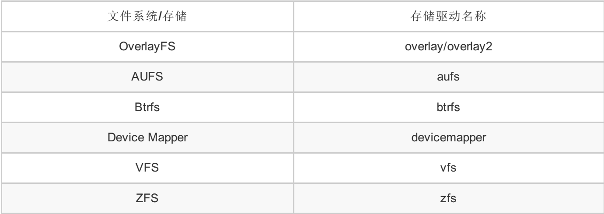

## Docker 镜像元数据之存储管理

### Docker存储驱动简介
		Docker内置多种存储驱动，每种存储驱动都是基于Linux文件系统（Linux FS）或者卷管理（Volume Manager）技术。一般来说，Docker存储驱动的名称与文件系统（存储技术）同名，见下表对应关系：


		Docker 镜像在设计上将镜像元数据和镜像文件的存储完全隔离开了。Docker 在管理镜像层元数据时采用的是从上至下 repository、image 和 layer 三个层次。由于 docker 以分层的形式存储镜像，所以 repository 和 image 这两类元数据并没有物理上的镜像文件与之对应，而 layer 这种元数据则存在物理上的镜像层文件与之对应。接下来我们就介绍这些元数据的管理与存储。

### repository 元数据

		repository 是由具有某个功能的 docker 镜像的所有迭代版本构成的镜像库。Repository 在本地的持久化文件存放于 /var/lib/docker/image/<graph_driver>/repositories.json 中，下图显示了 docker 使用 aufs 存储驱动时 repositories.json 文件的路径：

```bash
root@QT-SERVER-11:/var/lib/docker/image/aufs# ls
distribution  imagedb  layerdb  repositories.json
```

###### layer目录
	layer中镜像ID对应的是一个文件，文件的内容是就是该镜像的祖先镜像列表，镜像各层是怎么组织的 metadata，每个文件代表一个层，这个文件中保存着它下面所有层的 ID（按照顺序）

```bash
root@QT-SERVER-11:/var/lib/docker/aufs/layers# ll
total 1872
-rw-r--r-- 1 root root   845 May 24 16:53 012a29ea93838909234df5108572f4c7bbfc3e752316212cadd8923fec0ce266
-rw-r--r-- 1 root root   390 Apr 21  2017 016f932b13a671428c9b016cec67e4e3b736ae30f4f95e4d31009341aa3b4020
-rw-r--r-- 1 root root   785 Jul  3  2017 01955f2fb04524a2c64425b9bf120b82cd4d706d544b424d7a18ff0b76ee2c05
-rw-r--r-- 1 root root   715 Jul  3  2017 01955f2fb04524a2c64425b9bf120b82cd4d706d544b424d7a18ff0b76ee2c05-init
-rw-r--r-- 1 root root   520 May 25 17:03 0198c62ccde26b99a62c1208446c9b54b1052f29b35d4fed3644a013998b7572
-rw-r--r-- 1 root root  1175 Aug  2 19:02 01fae0a6e70967b07d587d5e32f02478573650a50e58f854227646d8eb0cc937
```


###### diff目录
	镜像每一层的内容，每个文件夹代表一个层

###### mnt目录
	镜像或者容器的 mountpoints，也就是容器最终看到的文件系统的样子

### Docker镜像详细信息

		先来看看镜像，docker 的镜像是分层的，而且这些层之间有父子关系，它们共同组成了我们看到的一个个镜像。在本地，这些层是保存在 /var/lib/docker/aufs/diff 目录下的，我们可以用 docker inspect ubuntu:16.04 查看 ubuntu:16.04 有哪些层：

```bash
"RootFS": {
        "Type": "layers",
        "Layers": [
            "sha256:90edd0ba21c8da7e530c3fdb0af496a07a33c285c7e51f30de80c50c624a5905",
            "sha256:267964ef478ec7e5969fc9c6efa41026195bc9bc4c6d6a06aa319adbd4378b5c",
            "sha256:bec30309c6f4462637b06947692a17fd3e3ba6a0233f74c7c9292b4930421541",
            "sha256:5f70bf18a086007016e948b04aed3b82103a36bea41755b6cddfaf10ace3c6ef",
            "sha256:4a3596d391da67de46a4f50b07f69277e4c81d65debdf68b99aa726959602e39",
            "sha256:72a672688aec3c93f4a1c6af75494c163347ad5319a582fe01c435bc84b08295",
            "sha256:11d4787bae4222ff2790dc6d9678d8c205286b86c33cad3ec80762602799384c",
            "sha256:0e593a4c1af6701dd33b58fead3fdb276cd2b87f020085297e8f690316e61b85",
            "sha256:5f70bf18a086007016e948b04aed3b82103a36bea41755b6cddfaf10ace3c6ef",
            "sha256:5f70bf18a086007016e948b04aed3b82103a36bea41755b6cddfaf10ace3c6ef"
        ]
    }
```
	可以看到，ubuntu:16.04 一共有 10 层，每一层都对应了 aufs/diff 下面的一个目录，但是每个目录名和上面的 sha256 ID 并不相同

### Docker本地存储目录

###### 查看容器ID

```bash
root@QT-SERVER-11:~# docker ps
CONTAINER ID        IMAGE                                 COMMAND                  CREATED             STATUS                PORTS                                                                                                                       NAMES
19a7e7dc2113        rancher/scheduler:v0.8.3              "/.r/r /rancher-en..."   2 hours ago         Up 2 hours
88440bddac1b        rancher/healthcheck:v0.3.6            "/.r/r /rancher-en..."   4 days ago          Up 4 days
bf98b1927489        paas-cloud-vas-web                    "/usr/local/tomcat..."   2 weeks ago         Up 4 days             0.0.0.0:28045->8080/tcp
dfe9d651c517        7bdd73b1decc                          "/usr/local/tomcat..."   2 weeks ago         Up 4 days             0.0.0.0:28041->8080/tcp
32a5a1a03487        3187f801b063                          "/usr/local/tomcat..."   2 weeks ago         Up 4 days             0.0.0.0:28044->8080/tcp
```
###### 查看容器对应的本地存储目录ID
```bash
root@QT-SERVER-11:/var/lib/docker/image/aufs/layerdb/mounts# cd 5d513bff947dca44a5e3907c5c0f6510b25b87bcaa8fde5e875ac785eea1af62/
root@QT-SERVER-11:/var/lib/docker/image/aufs/layerdb/mounts/5d513bff947dca44a5e3907c5c0f6510b25b87bcaa8fde5e875ac785eea1af62# ls
init-id  mount-id  parent
root@QT-SERVER-11:/var/lib/docker/image/aufs/layerdb/mounts/5d513bff947dca44a5e3907c5c0f6510b25b87bcaa8fde5e875ac785eea1af62# more mount-id
c27bc22b11c2a191a4af9a5804fcd49aa5fd7c1429486e038f6cd85a9909e48b
```
###### 本地镜像存储路径

```bash
root@QT-SERVER-11:/var/lib/docker/aufs/diff# cd c27bc22b11c2a191a4af9a5804fcd49aa5fd7c1429486e038f6cd85a9909e48b
root@QT-SERVER-11:/var/lib/docker/aufs/diff/c27bc22b11c2a191a4af9a5804fcd49aa5fd7c1429486e038f6cd85a9909e48b# ls
opt  root  tmp
```


