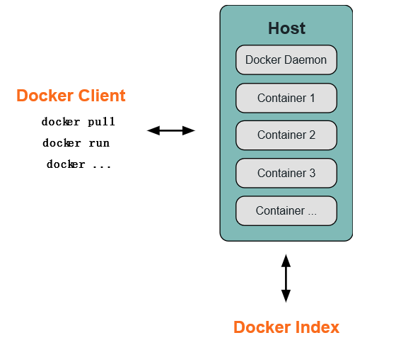
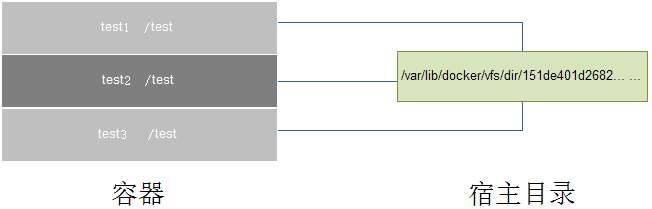

## Docker笔记

###### 介绍
	Docker: 开源的容器虚拟化平台
    docker 使用客户端-服务器 (C/S) 架构模式。Docker 客户端会与 Docker 守护进程进行通信。

###### Docker 守护进程
	Docker 守护进程运行在一台主机上。用户并不直接和守护进程进行交互，而是通过 Docker 客户端间接和其通信

###### Docker 内部
	Docker 镜像 - Docker images   --- Docker 镜像是  Docker 容器运行时的只读模板，每一个镜像由一系列的层 (layers) 组成
    Docker 仓库 - Docker registeries   ---  Docker 仓库用来保存镜像，可以理解为代码控制中的代码仓库
    Docker 容器 - Docker containers	---   Docker 容器和文件夹很类似，一个Docker容器包含了所有的某个应用运行所需要的环境.Docker 容器可以运行、开始、停止、移动和删除。每一个 Docker 容器都是独立和安全的应用平台，Docker 容器是 Docker 的运行部分

###### 安装

	install docker：
	linux：Centos下安装，yum install docker，然后启动docker：service docker start
	windows：安装 Docker Toolbox，一步一步默认安装即可，安装完成运行Docker quickstart即可，如果启动失败可能是boot2docker启动器下不来，需要手动下载放到C盘目录下即可。默认启动一个192.168.0.99.100的镜像服务器。

## 镜像Build
	Dockerfile文件：
    Command指令：
    FROM
	MAINTAINER
	RUN
	CMD
	EXPOSE
	ENV
	ADD
	COPY
	ENTRYPOINT
	VOLUME
	USER
	WORKDIR
	ONBUILD
    详解：
    1.From ：指定构建镜像的基础镜像，可以出现多个，如果本地没有镜像，则将从远程公共库pull下来
    	FROM <image>
    2.MAINTAINER ：指定创建镜像的用户
    	MAINTAINER <name>
    3.RUN  有两种使用方式，每条RUN指令将在当前镜像基础上执行指定命令，并提交为新的镜像
		RUN
		RUN "executable", "param1", "param2"
        exec 方式：解析为一个 JSON 数组，所以必须使用双引号而不是单引号exec 方式不会调用一个命令 shell，所以也就不会继承相应的变量
        RUN [ "sh", "-c", "echo", "$HOME" ]
    4.CMD：三种使用方式，CMD指定在 Dockerfile 中只能使用一次。注意：CMD会在启动容器的时候执行，build 时不执行，而RUN只是在构建镜像的时候执行，后续镜像构建完成之后，启动容器就与RUN无关了
    	CMD "executable","param1","param2"
		CMD "param1","param2"
		CMD command param1 param2 (shell form)
    5.EXPOSE ： Docker 服务端容器对外映射的本地端口，需要在 docker run 的时候使用-p或者-P选项生效
    6.ENV ： 指定环境变量，会被后续RUN指令使用，并在容器运行时保留
    	ENV <key> <value>       # 只能设置一个变量
		ENV <key>=<value> ...   # 允许一次设置多个变量
    7.ADD ： ADD复制本地主机文件、目录或者远程文件 URLS 从 并且添加到容器指定路径中，支持正则模糊匹配
    	路径必须是 Dockerfile 所在路径的相对路径，如果是一个目录，只会复制目录下的内容，而目录本身则不会被复制
    	ADD <src>... <dest>
    8.COPY ： COPY复制新文件或者目录从 并且添加到容器指定路径中 。用法同ADD，唯一的不同是不能指定远程文件 URLS
    	COPY <src>... <dest>
    9.ENTRYPOINT ： 配置容器启动后执行的命令，并且不可被 docker run 提供的参数覆盖，而CMD是可以被覆盖的。如果需要覆盖，则可以使用docker run --entrypoint选项，每个dockfile中只能有一个
    	ENTRYPOINT "executable", "param1", "param2"
		ENTRYPOINT command param1 param2 (shell form)
    10.VOLUME ： 创建一个可以从本地主机或其他容器挂载的挂载点
    	VOLUME ["/data"]
    11.USER ： 指定运行容器时的用户名或 UID，后续的RUN、CMD、ENTRYPOINT也会使用指定用户
    	USER daemon
    12.WORKDIR ： 为后续的RUN、CMD、ENTRYPOINT指令配置工作目录可以使用多个WORKDIR指令，后续命令如果参数是相对路径，则会基于之前命令指定的路径
    	WORKDIR /path/to/workdir
    13.ONBUILD ： 配置当所创建的镜像作为其它新创建镜像的基础镜像时，所执行的操作指令
    	ONBUILD [INSTRUCTION]
        example：
        		Dockerfile 使用如下的内容创建了镜像 image-A：
				[...]
				ONBUILD ADD . /app/src
				ONBUILD RUN /usr/local/bin/python-build --dir /app/src
				[...]
				如果基于 image-A 创建新的镜像时，新的 Dockerfile 中使用 FROM image-A 指定基础镜像时，会自动执行 ONBUILD 指令内容，等价于在后面添加了两条指令。
				# Automatically run the following
				ADD . /app/src
				RUN /usr/local/bin/python-build --dir /app/src
				使用ONBUILD指令的镜像，推荐在标签中注明，例如 ruby:1.9-onbuild

## Dockerfile Examples
	# Nginx
	#
	# VERSION               0.0.1

	FROM      ubuntu
	MAINTAINER Victor Vieux <victor@docker.com>

	RUN apt-get update && apt-get install -y inotify-tools nginx apache2 openssh-server

	# Firefox over VNC
	#
	# VERSION               0.3

	FROM ubuntu

	# Install vnc, xvfb in order to create a 'fake' display and firefox
	RUN apt-get update && apt-get install -y x11vnc xvfb firefox
	RUN mkdir ~/.vnc
	# Setup a password
	RUN x11vnc -storepasswd 1234 ~/.vnc/passwd
	# Autostart firefox (might not be the best way, but it does the trick)
	RUN bash -c 'echo "firefox" >> /.bashrc'

	EXPOSE 5900
	CMD    ["x11vnc", "-forever", "-usepw", "-create"]

	# Multiple images example
	#
	# VERSION               0.1

	FROM ubuntu
	RUN echo foo > bar
	# Will output something like ===> 907ad6c2736f

	FROM ubuntu
	RUN echo moo > oink
	# Will output something like ===> 695d7793cbe4

	# You᾿ll now have two images, 907ad6c2736f with /bar, and 695d7793cbe4 with
	# /oink.

## docker build 构建镜像
	$ docker build --help

	Usage: docker build [OPTIONS] PATH | URL | -

	Build a new image from the source code at PATH

	--force-rm=false     Always remove intermediate containers, even after unsuccessful builds # 移除过渡容器，即使构建失败
    --no-cache=false     Do not use cache when building the image                              # 不实用 cache
    -q, --quiet=false    Suppress the verbose output generated by the containers
    --rm=true            Remove intermediate containers after a successful build               # 构建成功后移除过渡层容器
    -t, --tag=""         Repository name (and optionally a tag) to be applied to the resulting image in case of success

## dockerfile 最佳实践
	1.使用.dockerignore文件
		为了在docker build过程中更快上传和更加高效，应该使用一个.dockerignore文件用来排除构建镜像时不需要的文件或目录。例如,除非.Git在构建过程中需要用到，否则你应该将它添加到.dockerignore文件中，这样可以节省很多时间。
	2.  避免安装不必要的软件包
		为了降低复杂性、依赖性、文件大小以及构建时间，应该避免安装额外的或不必要的包。例如，不需要在一个数据库镜像中安装一个文本编辑器
    3.多行参数排序
    	如果可能，通过字母顺序来排序，这样可以避免安装包的重复并且更容易更新列表，另外可读性也会更强，添加一个空行使用\换行:
		RUN apt-get update && apt-get install -y \
		bzr \
	    cvs \
		git \
		mercurial \
		subversion

## Dockerfile 指令
	FROM: 只要可能就使用官方镜像库作为基础镜像
    RUN: 为保持可读性、方便理解、可维护性，把长或者复杂的RUN语句使用\分隔符分成多行
	不建议RUN apt-get update独立成行，否则如果后续包有更新，那么也不会再执行更新
	避免使用RUN apt-get upgrade或者dist-upgrade，很多必要的包在一个非privileged权限的容器里是无法升级的。如果知道某个包更新，使用apt-get install -y xxx
	标准写法
	RUN apt-get update && apt-get install -y package-bar package-foo
	CMD: 推荐使用CMD [“executable”, “param1”, “param2”…]这种格式，CMD [“param”, “param”]则配合ENTRYPOINT使用
	EXPOSE: Dockerfile 指定要公开的端口，使用docker run时指定映射到宿主机的端口即可
	ENV: 为了使新的软件更容易运行，可以使用ENV更新PATH变量。如ENV PATH /usr/local/nginx/bin:$PATH确保CMD ["nginx"]即可运行
	ENV也可以这样定义变量：
    	ENV PG_MAJOR 9.3
		ENV PG_VERSION 9.3.4
		RUN curl -SL http://example.com/postgres-$PG_VERSION.tar.xz | tar -xJC /usr/src/postgress && …
		ENV PATH /usr/local/postgres-$PG_MAJOR/bin:$PATH
    ADD or COPY:ADD比COPY多一些特性「tar 文件自动解包和支持远程 URL」，不推荐添加远程 URL
    不推荐这种方式：
	    ADD http://example.com/big.tar.xz /usr/src/things/
		RUN tar -xJf /usr/src/things/big.tar.xz -C /usr/src/things
		RUN make -C /usr/src/things all
    推荐使用 curl 或者 wget 替换，使用如下方式:
    	RUN mkdir -p /usr/src/things \
	    && curl -SL http://example.com/big.tar.gz \
	    | tar -xJC /usr/src/things \
	    && make -C /usr/src/things all
    如果不需要添加 tar 文件，推荐使用COPY

## 容器数据管理
支持两种方式管理数据
###### 数据卷
###### 数据卷容器

	$ sudo docker run --name data -v /data -t -i ubuntu:14.04 /bin/bash # 创建数据卷绑定到到新建容器，新建容器中会创建 /data 数据卷 bash-4.1# ls -ld /data/
    drwxr-xr-x 2 root root 4096 Jul 23 06:59 /data/
    bash-4.1# df -Th
    Filesystem    Type    Size  Used Avail Use% Mounted on
    ... ...
                  ext4     91G  4.6G   82G   6% /data

###### 创建的数据卷可以通过docker inspect获取宿主机对应路径
	$ sudo docker inspect data
	... ... "Volumes": { "/data": "/var/lib/docker/vfs/dir/151de401d268226f96d824fdf444e77a4500aed74c495de5980c807a2ffb7ea9" }, # 可以看到创建的数据卷宿主机路径 ... ...
###### 或者直接指定获取
    $ sudo docker inspect --format="{{ .Volumes }}" data
    map[/data: /var/lib/docker/vfs/dir/151de401d268226f96d824fdf444e77a4500aed74c495de5980c807a2ffb7ea9]

###### 挂载宿主机目录为一个数据卷
	-v选项除了可以创建卷，也可以挂载当前主机的一个目录到容器中。

###### 例子
	$ sudo docker run --name web -v /source/:/web -t -i ubuntu:14.04 /bin/bash
    bash-4.1# ls -ld /web/
    drwxr-xr-x 2 root root 4096 Jul 23 06:59 /web/
    bash-4.1# df -Th
    ... ...
                  ext4     91G  4.6G   82G   6% /web
	bash-4.1# exit

###### 创建和挂载一个数据卷容器
	如果你有一些持久性的数据并且想在容器间共享，或者想用在非持久性的容器上，最好的方法是创建一个数据卷容器，然后从此容器上挂载数据。
###### 创建数据卷容器
	$ sudo docker run -t -i -d -v /test --name test ubuntu:14.04 echo hello
    使用--volumes-from选项在另一个容器中挂载 /test 卷。不管 test 容器是否运行，其它容器都可以挂载该容器数据卷，当然如果只是单独的数据卷是没必要运行容器的
    $ sudo docker run -t -i -d --volumes-from test --name test1 ubuntu:14.04 /bin/bash
###### 添加另一个容器
    $ sudo docker run -t -i -d --volumes-from test --name test2 ubuntu:14.04 /bin/bash
###### 也可以继承其它挂载有 /test 卷的容器
	$ sudo docker run -t -i -d --volumes-from test1 --name test3 ubuntu:14.04 /bin/bash

###### 备份、恢复或迁移数据卷
###### 备份
	$ sudo docker run --rm --volumes-from test -v $(pwd):/backup ubuntu:14.04 tar cvf /backup/test.tar /test
    tar: Removing leading `/' from member names
    /test/
    /test/b
    /test/d
    /test/c
    /test/a
    说明：启动一个新的容器并且从test容器中挂载卷，然后挂载当前目录到容器中为 backup，并备份 test 卷中所有的数据为 test.tar，执行完成之后删除容器--rm，此时备份就在当前的目录下，名为test.tar

###### 恢复
	你可以恢复给同一个容器或者另外的容器，新建容器并解压备份文件到新的容器数据卷
	$ sudo docker run -t -i -d -v /test --name test4 ubuntu:14.04  /bin/bash
    $ sudo docker run --rm --volumes-from test4 -v $(pwd):/backup ubuntu:14.04 tar xvf /backup/test.tar -C /
    # 恢复之前的文件到新建卷中，执行完后自动删除容器 test/ test/b test/d test/c test/a

###### 删除 Volumes
	docker rm -v删除容器时添加了-v选项
	docker run --rm运行容器时添加了--rm选项
	否则，会在/var/lib/docker/vfs/dir目录中遗留很多不明目录。

## 链接容器
	docker 允许把多个容器连接在一起，相互交互信息。docker 链接会创建一种容器父子级别的关系，其中父容器可以看到其子容器提供的信息

###### 容器命名
	在创建容器时，如果不指定容器的名字，则默认会自动创建一个名字，这里推荐给容器命名：
###### 1、给容器命名方便记忆，如命名运行 web 应用的容器为 web
###### 2、为 docker 容器提供一个参考，允许方便其他容器调用，如把容器 web 链接到容器 db
###### 可以通过--name选项给容器自定义命名：
	$ sudo docker run -d -t -i --name test ubuntu:14.04 bash
    $ sudo docker  inspect --format="{{ .Nmae }}" test
    /test
###### 注：容器名称必须唯一，即你只能命名一个叫test的容器。如果你想复用容器名，则必须在创建新的容器前通过docker rm删除旧的容器或者创建容器时添加--rm选项。

###### 链接容器
	$ sudo docker run -d --name db training/postgres

###### 基于 training/postgres 镜像创建一个名为 db 的容器，然后下面创建一个叫做 web 的容器，并且将它与 db 相互连接在一起
	$ sudo docker run -d -P --name web --link db:db training/webapp python app.py
###### --link <name or id>:alias选项指定链接到的容器

###### 查看 web 容器的链接关系:
	$ sudo docker inspect -f "{{ .HostConfig.Links }}" web
	[/db:/web/db]
###### 容器之间的链接实际做了什么？一个链接允许一个源容器提供信息访问给一个接收容器。在本例中，web 容器作为一个接收者，允许访问源容器 db 的相关服务信息。Docker 创建了一个安全隧道而不需要对外公开任何端口给外部容器，因此不需要在创建容器的时候添加-p或-P指定对外公开的端口，这也是链接容器的最大好处，本例为 PostgreSQL 数据库

## 构建私有库
###### Docker 官方提供了 docker registry 的构建方法 docker-registry
###### 构建docker-registry仓库
	安装 docker
	运行 registry:docker run -p 5000:5000 registry
	这种方法通过 Docker hub 使用官方镜像 official image from the Docker hub

###### 使用 github clone 手动安装

    $ git clone https://github.com/dotcloud/docker-registry.git
    $ cd docker-registry/
    $ cp config/config_sample.yml config/config.yml
    $ mkdir /data/registry -p
    $ pip install .
###### 运行
	docker-registry

###### 提交指定容器到私有库
	$ docker tag ubuntu:12.04 私有库IP:5000/ubuntu:12.04
	$ docker push 私有库IP:5000/ubuntu

