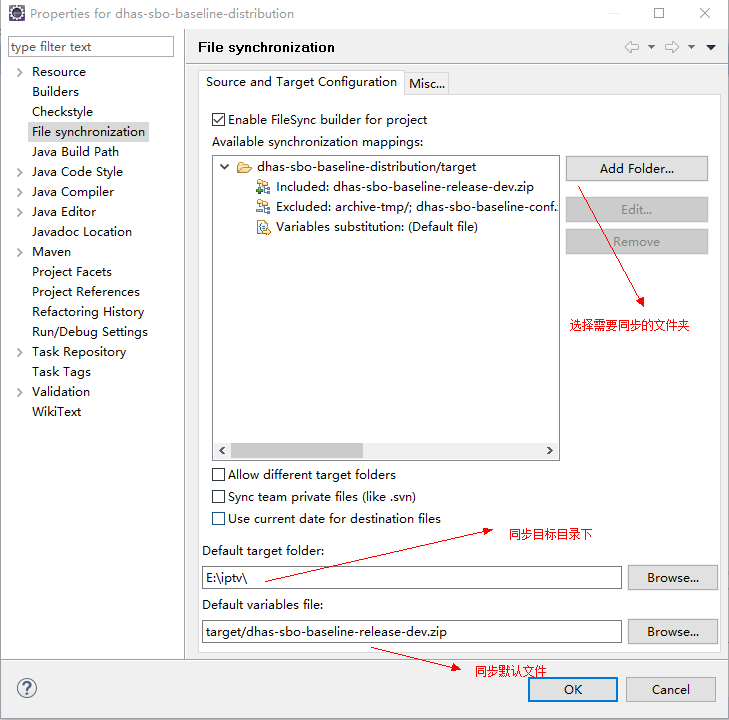
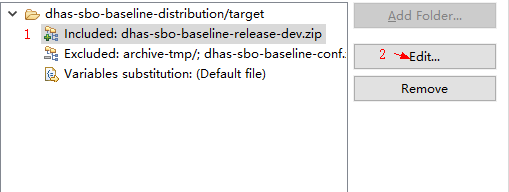
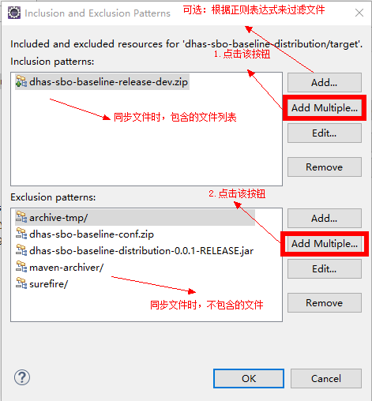

## FileSync使用
eclipse安装FileSync插件
1.手动下载FileSync安装包，解压到eclipse的插件目录下（自行百度）
2.在eclipse下的help菜单下选择Eclipse Marketplace，搜索FileSync安装，重启即可

###### 配置：
	*点击项目propertys，选择菜单File synchronization
###### eg:

	配置需要同步的文件，过滤不需要同步的文件
###### eg：

	*选中文件（支持正则表达式匹配）

