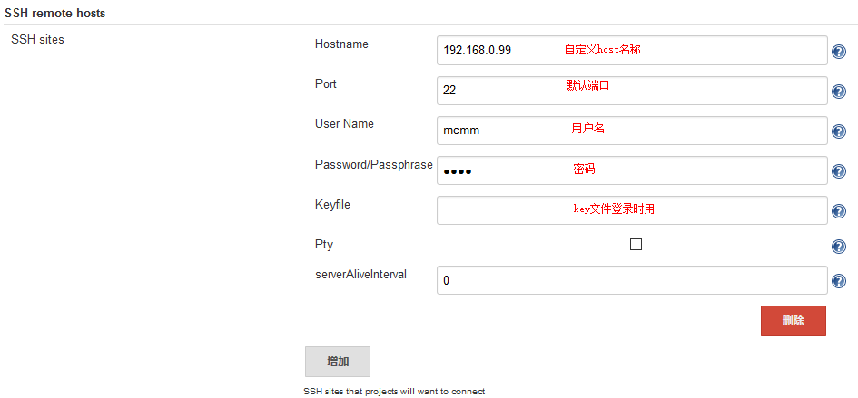
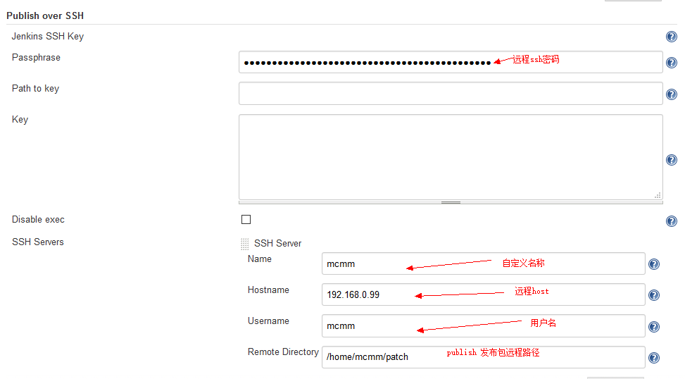
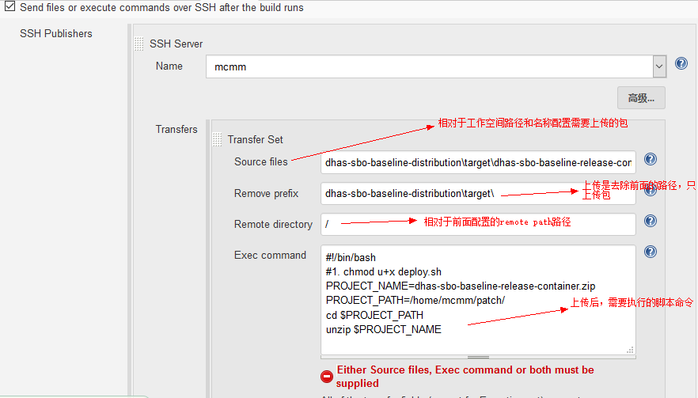
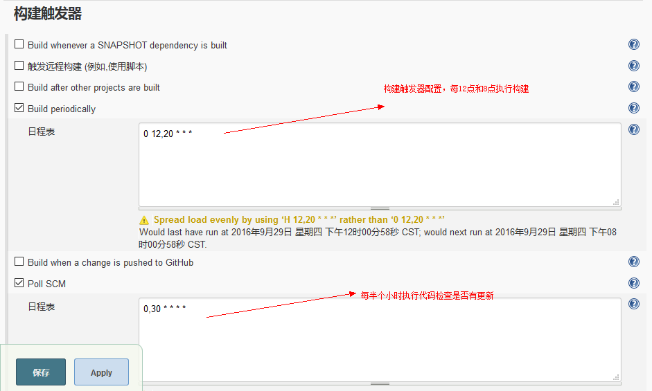

## JenKins持续集成环境搭建

	1.jenkins官网下载jJenKins的war包 https://jenkins.io/index.html

	2.下载最新jenkins.war包，放到tomcat下启动，初始化时比较慢，默认在系统目录下有一个密码文件，启动时需要改密码

	3.设置用户/密码，进入jenkins下的home目录下

	4.插件安装：publish over ssh、ftp、deploy、ssh、sonar等插件

	5.配置jenkins全局值

###### SSH 远程执行脚本时，需要配置

###### Publish over SSH插件配置，发布包到远程服务器上

###### 项目自动部署

###### 项目构建触发器

